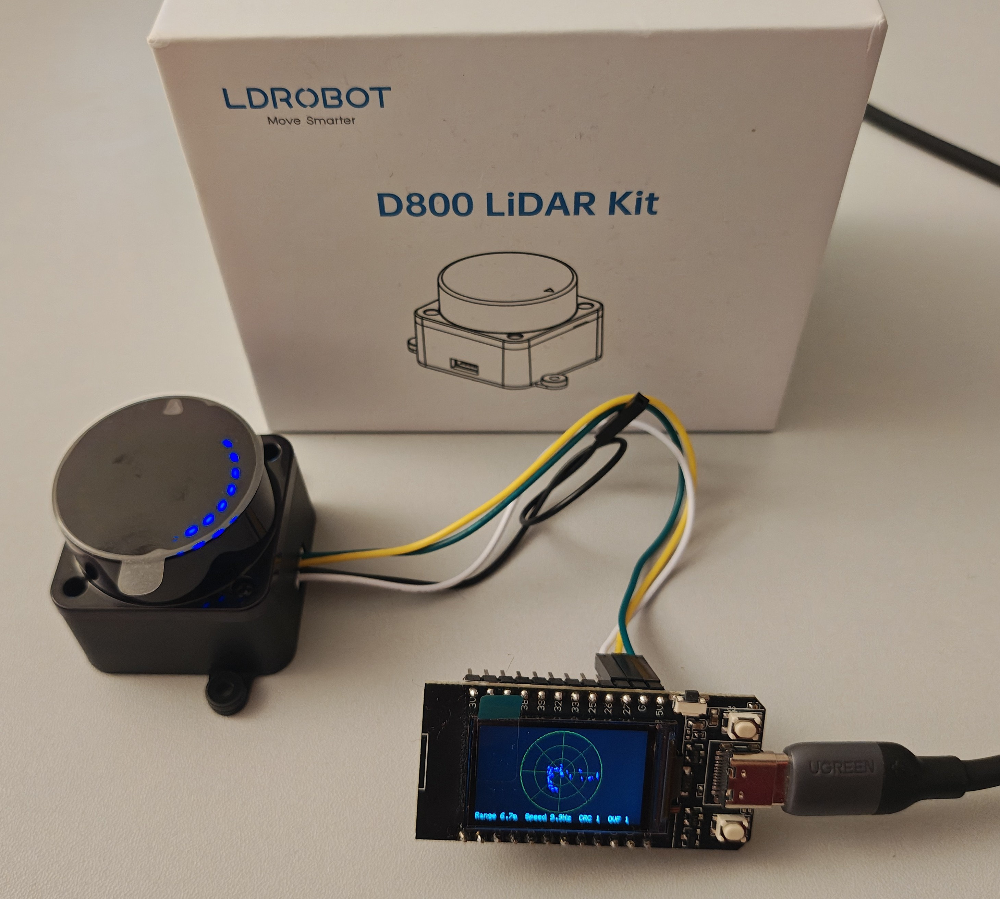

# T-Display ESP32 + STL-27L LiDAR Radar

A live 2D radar visualisation driven by an **STL-27L** (LDROBOT D800 family)
2D LiDAR sensor and rendered on a **TTGO T-Display** ESP32 board with its
on-board 135 × 240 ST7789 TFT.



The sketch in [`src/main.ino`](src/main.ino) polls the sensor over UART2 at
921 600 baud, decodes each 47-byte packet (CRC-8, polynomial 0x4D) into 720
angular bins via the [`STL27L`](lib/STL27L) library, and once per revolution
draws a top-down radar (grid, range rings, sweep, status line) into an
off-screen `TFT_eSprite` framebuffer that is then blitted to the display in a
single SPI transaction.

---

## Hardware

| Item | Notes |
|---|---|
| TTGO T-Display | ESP32, 1.14" ST7789 135 × 240 TFT, on-board USB-UART |
| STL-27L LiDAR | LDROBOT D800 kit, 921 600 baud, 12 points/packet, 360°/rev |
| USB cable | For power, flashing and the serial monitor |

---

## Pin hook-up

| STL-27L pin | Wire function | ESP32 GPIO | Notes |
|---|---|---|---|
| 1 | Tx (data) | **GPIO 27** | `LIDAR_DATA_PIN` in `src/main.ino` |
| 2 | PWM (motor speed) | **GPIO 26** | Optional — pass `-1` to `Lidar.begin()` if not wired. Leaving the sensor's PWM wire open also works. |
| 3 | GND | **GND** | Common ground is mandatory. |
| 4 | P5V | **5V** | Sensor power. |

> The motor can also run without an external PWM signal — the STL-27L falls
> back to its internal control. In that case leave pin 2 unconnected and pass
> `-1` for the PWM argument.

---

## Build and flash

```bash
# Compile + flash (PlatformIO will pick the only env: ttgo-t-display)
pio run -t upload

# Open the serial monitor at 921600 baud
pio device monitor
```

The PlatformIO configuration lives in [`platformio.ini`](platformio.ini).
Key flags:

- `-D STL27L_POINT_COUNT=720` — number of angular bins per revolution.
- `-D ST7789_DRIVER=1`, `TFT_WIDTH=135`, `TFT_HEIGHT=240` — native display.
- Classic TTGO T-Display pin set (MOSI=19, SCLK=18, CS=5, DC=16, RST=23, BL=4).
- `-D SPI_FREQUENCY=40000000` — ST7789 SPI clock.

The serial output reports the LiDAR speed (Hz), packet counters and any
UART/RX/CRC errors once per revolution, e.g.:

```
Revolution complete: speed=10.42 Hz, packets=87, CRC errors=0, RX errors=0, UART overflows=0
```

---

## How it works

1. `STL27LClass::begin()` opens UART2 with a 32 KiB RX ring buffer,
   installs an overflow callback, and (optionally) attaches an LEDC
   channel to the motor pin at 1 kHz / 62 % duty.
2. `Lidar.update()` drains whatever bytes the UART has buffered, finds the
   next packet header in bulk with `std::memchr`, copies the remaining
   packet body with `std::memcpy`, CRC-checks the 47-byte body (table-
   based, polynomial 0x4D) and stores each of the 12 measurement points
   into the nearest angular bin.
3. Once `update()` detects the angle wrap-around (300° → 60°) it ages
   every stored point by one revolution and sets the `available()` flag.
4. The application redraws the radar into a `TFT_eSprite`, pushes the
   sprite to the display in a single SPI burst, and reports statistics
   over the serial monitor.

The display scale is **automatic**: it grows quickly when a more distant
point appears and shrinks slowly when distant points disappear, to reduce
flicker. All measurements outside `[100 mm, 15000 mm]` are ignored.

---

## Project layout

```
.
├── README.md                      ← this file
├── platformio.ini                 ← PlatformIO config (env, TFT pins, flags)
├── img/
│   └── TDisplay_STL27L_Lidar.jpg  ← hardware photo
├── lib/
│   └── STL27L/
│       ├── library.json           ← PlatformIO library metadata
│       └── src/
│           ├── STL27L.h           ← driver API
│           └── STL27L.cpp         ← driver implementation
└── src/
    └── main.ino                   ← T-Display sketch
```

---

## License

This project is released into the public domain.

```
This is free and unencumbered software released into the public domain.
Anyone is free to copy, modify, publish, use, compile, sell, or
distribute this software, either in source code form or as a compiled
binary, for any purpose, commercial or non-commercial, and by any
means.

In jurisdictions that recognize copyright laws, the author or authors
of this software dedicate any and all copyright interest in the
software to the public domain. We make this dedication for the benefit
of the public at large and to the detriment of our heirs and
successors. We intend this dedication to be an overt act of
relinquishment in perpetuity of all present and future rights to this
software under copyright law.

THE SOFTWARE IS PROVIDED "AS IS", WITHOUT WARRANTY OF ANY KIND,
EXPRESS OR IMPLIED, INCLUDING BUT NOT LIMITED TO THE WARRANTIES OF
MERCHANTABILITY, FITNESS FOR A PARTICULAR PURPOSE AND NONINFRINGEMENT.
IN NO EVENT SHALL THE AUTHORS BE LIABLE FOR ANY CLAIM, DAMAGES OR
OTHER LIABILITY, WHETHER IN AN ACTION OF CONTRACT, TORT OR OTHERWISE,
ARISING FROM, OUT OF OR IN CONNECTION WITH THE SOFTWARE OR THE USE OR
OTHER DEALINGS IN THE SOFTWARE.

For more information, please refer to <https://unlicense.org>
```
